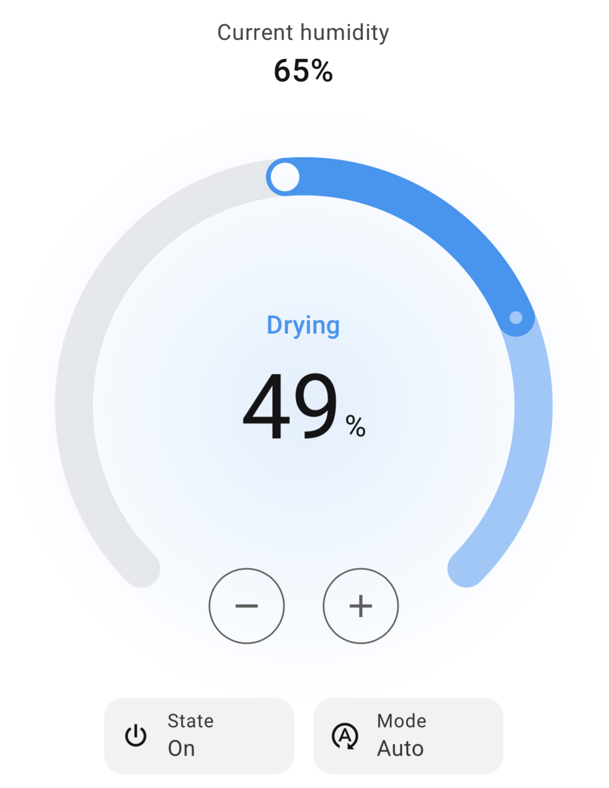

# ESPHome Dehumidifier — Home Assistant MQTT Integration

This project allows you to expose a dehumidifier as a single native Home Assistant `humidifier` entity via MQTT discovery, using ESPHome. This gives you a proper dehumidifier entity in Home Assistant, with full support for the [**humidifier card**](https://www.home-assistant.io/dashboards/humidifier/) (just like the [`generic_hygrostat`](https://www.home-assistant.io/integrations/generic_hygrostat/) integration in Home Assistant), target humidity control, mode selection, and current humidity readout. No extra configuration is needed in Home Assistant, except for a MQTT broker such as Mosquitto.

<p align="center">
  
</p>

This repository provides a workaround while waiting for native ESPHome support, tracked in [#6678](https://github.com/esphome/esphome/pull/6678).

If the entity doesn't show up in the MQTT entities list, try reloading the MQTT integration.

Versions:

- **standard** (<u>recommended</u>) - replicates the `generic_hygrostat` behavior from ESPHome. It controls the device based on humidity, with two modes:
  - Auto - turns the device on or off automatically to maintain a target humidity level;
  - Always on - keeps the device running continuously, regardless of humidity Simply provide a switch to turn on when drying is needed and a humidity sensor. 

  Use this version if you have the ability to control when the dehumidifier should turn on or off (e.g. through a smart plug, acting on the control panel). If you control directly the heat pump, consider using the full featured version.

- **minimal** - contains only the components needed to expose a dehumidifier entity to Home Assistant, including customizable mode support, and MQTT communication. The control logic is entirely up to you.

- **full featured** - designed for direct GPIO control of the heat pump and fan via relays, bypassing the dehumidifier's built-in logic and protections (tank full detection, defrost cycle), which are reimplemented by the integration (see disclaimer below). Includes full automation logic out of the box: humidity-based on/off control, defrost cycle (it's just a timer!), fan management, multiple modes (auto, laundry - always on, ventilation), and support for an external humidity sensor and a tank full sensor. Requires the following controls:
  - Relay: heat pump ON/OFF
  - Relay: fan ON/OFF
  - Relay: switch between high/low fan speed


> This project is provided as-is, without any warranty. Any use of this code and any modification to your dehumidifier are at your own risk. The author is not responsible for any damage or malfunction. If your setup involves high voltage, be aware that working with it is dangerous and potentially lethal.

---

## Standard Version

This version replicates the behavior of `generic_hygrostat` in ESPHome.

Fill the `secrets.yaml` file and the substitutions in `dehumidifier.yaml`.

Provide the configuration of your humidity sensor in `dehumidifier.yaml`. Please keep the `on_value: ...` setting.  Be sure to use the same ID that you substituted for `<YOUR_SENSOR_HUMIDITY_ID>`.

```yaml
sensor:
  - platform: ...
    name: "Humidity"
    id: humidity
    on_value: 
      then:
        - script.execute: apply_logic
```

For example, in case of `shtcx` (I2C configuration required, see [shtcx](https://esphome.io/components/sensor/shtcx/) and [I2C](https://esphome.io/components/i2c/)) use the configuration

```yaml
sensor:
  - platform: shtcx
    update_interval: 60s
    humidity:
      name: "Humidity"
      id: humidity
      on_value:
        then:
          - script.execute: apply_logic
```

Provide the drying control switch. Be sure to use the same ID that you substituted for `<YOUR_DRYING_SWITCH_ID>`.

```yaml
 switch:
   - platform: ...
     id: drying
```

For example, if you control a relay, your configuration may be

```yaml
 switch:
   - platform: gpio
     id: drying
     pin:
       number: GPIO27
       inverted: true
```

---

## Minimal Version

Fill the `secrets.yaml` file and the substitutions in `dehumidifier.yaml`.

Depending on what you want to expose in Home Assistant (humidity, humidity target, modes, etc), follow the instructions below. If you don't need to expose some of the components, remove them from `dehumidifier.yaml` and remove the corresponding entries in `mqtt/on_message.yaml`, `mqtt/publish_state.yaml`, and `mqtt/discovery.yaml`. All of them are optional (see [MQTT Humidifier](https://www.home-assistant.io/integrations/humidifier.mqtt/)).

### State -  `switch` 

Represents whether the dehumidifier is ON or OFF. By default it uses a template switch. If your hardware provides actual feedback, you can pair it with a [GPIO binary sensor](https://esphome.io/components/binary_sensor/gpio/) to reflect the actual state and remove `optimistic: true`.

```yaml
switch:
  - platform: template
    name: "Dehumidifier State"
    id: state
    optimistic: true
    on_state:
      then:
        - script.execute: publish_full_state
```

It is controlled in `mqtt/on_message.yaml` 

```yaml
topic: ${entity_id}/command
```

publishes its state in `mqtt/publish_state.yaml`

```yaml
topic: ${entity_id}/state
```

and its discovery in `mqtt/discovery.yaml`

```yaml
"command_topic": "${entity_id}/command",
"state_topic": "${entity_id}/state"
```


### Current Humidity - `sensor` 

Reads the current humidity and publishes it to MQTT so Home Assistant can display it in the dehumidifier entity. Replace `<YOUR_SENSOR_PLATFORM>` with your actual sensor platform (e.g. `shtcx`).

```yaml
sensor:
  - platform: <YOUR_SENSOR_PLATFORM> 
    name: "Humidity"
    id: humidity
    on_value: ...
```

It publishes its value in `mqtt/publish_state.yaml`

```yaml
topic: ${entity_id}/current_hum
```

and its discovery in `mqtt/discovery.yaml`

```yaml
"current_humidity_topic":  "${entity_id}/current_hum"
```

For example, in case of `shtcx` (I2C configuration required, see [shtcx](https://esphome.io/components/sensor/shtcx/) and [I2C](https://esphome.io/components/i2c/)) use the configuration

```yaml
sensor:
  - platform: shtcx
    update_interval: 60s
    humidity:
      name: "Humidity"
      id: humidity
      on_value: ...
```


### Mode -`select`

Exposes the current mode of the dehumidifier. Modes are fully customizable. Replace the default options with whatever makes sense for your device.

```yaml
select:
  - platform: template
    name: "Dehumidifier Mode"
    id: mode
    optimistic: true
    options:
      - "auto" # customizable
      - "laundry" # customizable
      - "ventilation" # customizable
      - ...
```

⚠️ Modes must match the ones defined in `mqtt/discovery.yaml`

```yaml
"modes": ["auto", "laundry", "ventilation"],
```

It is controlled in `mqtt/on_message.yaml` 

```yaml
topic: ${entity_id}/mode_command
```

and publishes its value in `mqtt/publish_state.yaml`

```yaml
topic: ${entity_id}/mode_state
```

and its discovery in `mqtt/discovery.yaml`

```yaml
"mode_state_topic": "${entity_id}/mode_state",
"mode_command_topic": "${entity_id}/mode_command"
```


### Drying - `binary_sensor`

Used to report whether the dehumidifier is actively drying or just idle when turned on. Use the `lambda` to determine if the dehumidifier is drying, or replace with your own `platform` and remove the `lambda`. This component should represent the heat pump state. You may not have access to this information if you don't have direct control over the heat pump. In such case you can either remove this component or leave it with `return true`. If you do control the heat pump (when drying or not), this may be a `switch` instead.

```yaml
binary_sensor:
  - platform: template
    name: "Drying"
    id: drying
    lambda: |-
      return true; // Replace with actual logic
```

It publishes its state in `mqtt/publish_state.yaml`

```yaml
topic: ${entity_id}/action
```

and its discovery in in `mqtt/discovery.yaml`

```yaml
"action_topic": "${entity_id}/action"
```


### Target Humidity - `number`

Allows setting the target humidity level. You can use `id(target_humidity).state` in your own logic to act on it.

```yaml
number:
  - platform: template
    id: target_humidity
    name: "Target Humidity"
```

It is controlled in `mqtt/on_message.yaml` 

```yaml
topic: ${entity_id}/target_hum_cmd
```

and publishes its value in `mqtt/publish_state.yaml`

```yaml
topic: ${entity_id}/target_hum_state
```

and its discovery in in `mqtt/discovery.yaml`

```yaml
"target_humidity_state_topic": "${entity_id}/target_hum_state",
"target_humidity_command_topic": "${entity_id}/target_hum_cmd"
```
